footer: Curt Clifton—The Omni Group. May 9, 2015, CocoaConf PDX
slidenumbers: true

^ Sample presenter notes.

^ Are we good?

---

# [fit] Developing with
# [fit] WatchKit 1.0

^ [put this slide up at end of break]

^ [transition to introduce yourself]

---

# Developing with WatchKit 1.0

## Curt Clifton, The Omni Group

### @curtclifton

### curtclifton.net

---

# Outline

- Watch app parts
- Conceptual model
- Syncing data with Apple Watch
- Debugging Apple Watch apps
- Some challenges
- Other resources

^ [Discuss in terms of your goals for them leaving the talk]

---

# [fit] Watch App
# [fit] Parts

---

## Your Watch app can include notifications, glances, the main app, and handoff.

^ [builds on subsequent slides]

---

## Your Watch app can include notifications, glances, the main app, and handoff.

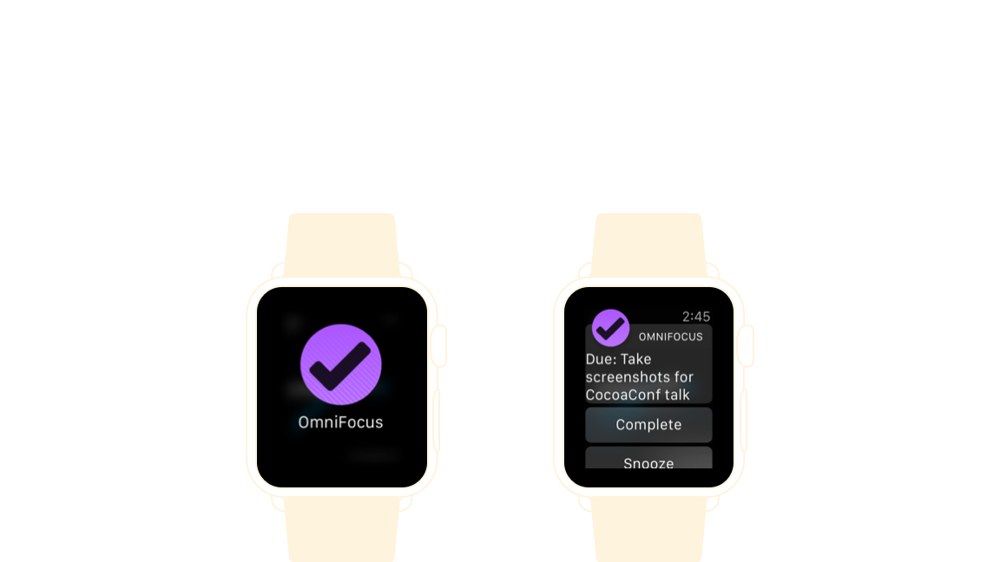

^ describe each piece
^ for each, discuss what you need to do as a dev
^ fast in, fast out

---

## Your Watch app can include notifications, glances, the main app, and handoff.

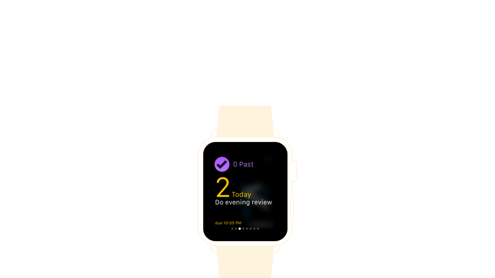

^ describe each piece
^ for each, discuss what you need to do as a dev
^ fast in, fast out

---

## Your Watch app can include notifications, glances, the main app, and handoff.

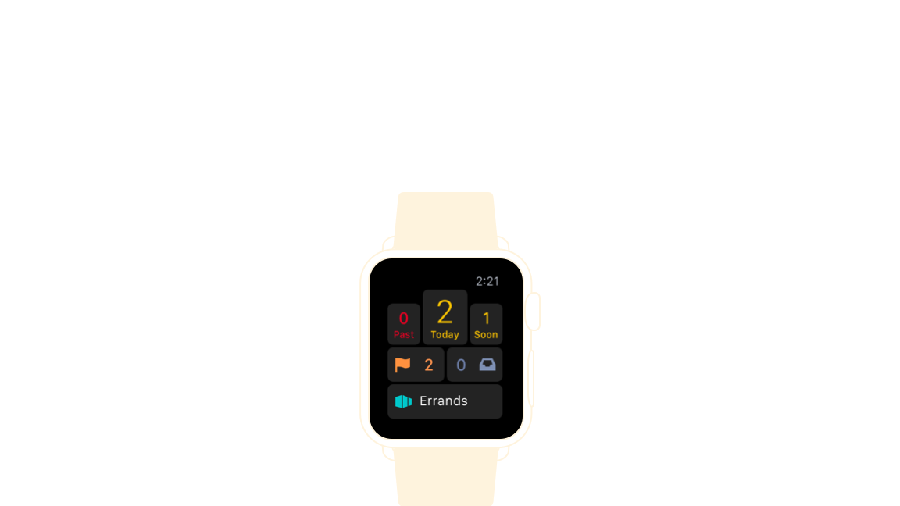

^ describe each piece
^ for each, discuss what you need to do as a dev
^ fast in, fast out

---

## Your Watch app can include notifications, glances, the main app, and handoff.

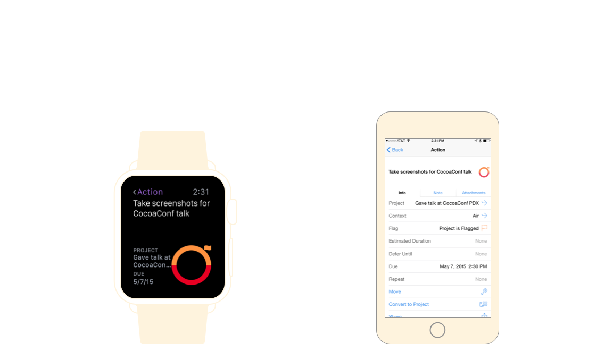

^ describe each piece
^ for each, discuss what you need to do as a dev
^ fast in, fast out

---

# [fit] Conceptual
# [fit] Model

---

## In WatchKit 1.0 your code *runs* in an extension *on the iPhone*.

^ WatchKit extension and Watch app resources are bundled with your iPhone app (like Today and Sharing extensions and custom keyboards)

---

## In WatchKit 1.0 your code *runs* in an extension *on the iPhone*.

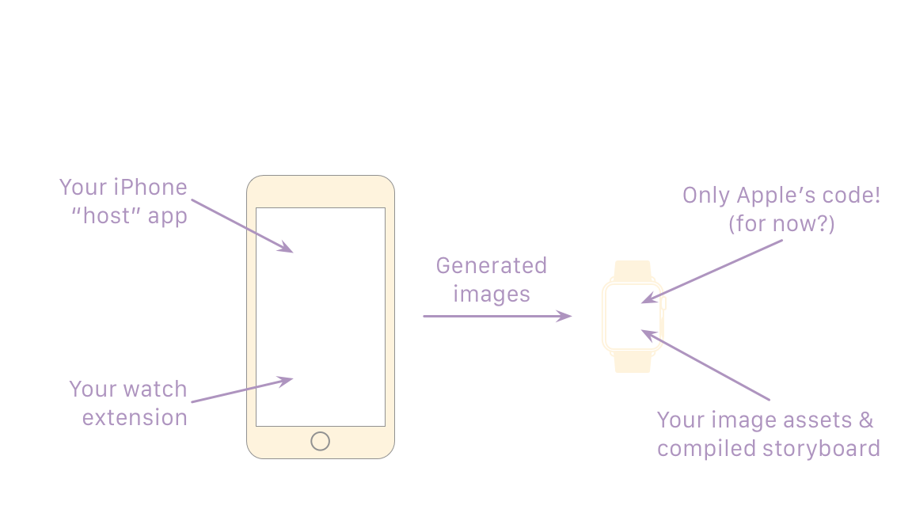

^ iPhone first

^ then watch

^ then generated images

^ “So the first thing to remember is that you’re writing code that runs on the iPhone. Almost all assets on the watch are put there statically at install time.”

^ The next piece of the conceptual model is that you have a limited set of classes to work with. In fact…

---

## All the WatchKit classes fit on one slide that you can read.

^ [beat]

---

## All the WatchKit classes fit on one slide that you can read.

^ “but I don’t expect you to.”

^ A couple of interface controllers. You’ll have one for each screen in your watch app.

^ One device class that vends a singleton. Can get device size and cache images with this.

^ All the rest are the classes for building your UI that David talks about.

^ “But what are these classes good for if we can’t run code on the watch?”

---

## All the WKInterfaceObjects are proxies for views on the watch.

---

## All the WKInterfaceObjects are proxies for views on the watch.

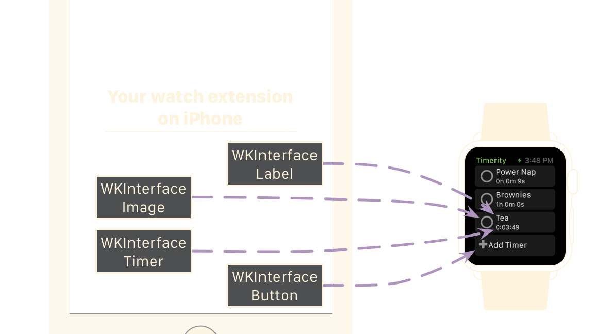 

^ [Quick hand-wavy explanation of the diagram. Details on next slide.]

^ The Apple docs say, “Interface objects are not views. They are proxy objects that communicate wirelessly with the actual views used to implement your UI on Apple Watch.”

^ “So what can you do with these objects? Let’s look at the methods available on WKInterfaceLabel.”

---

## All the WKInterfaceObjects are proxies for views on the watch.

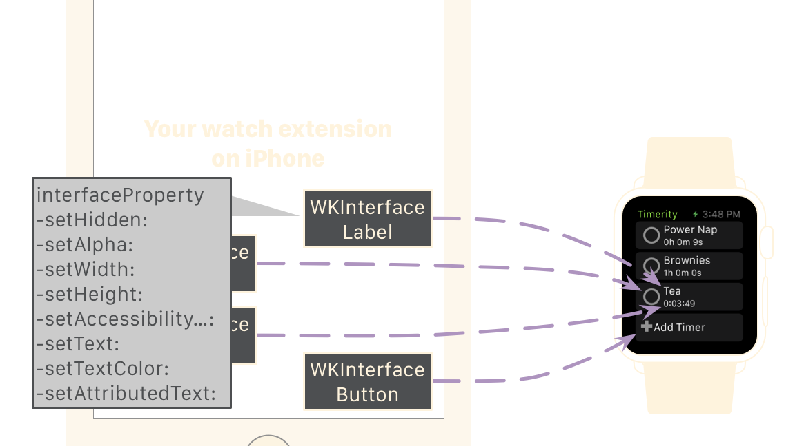

^ setters, not properties!

---

# Conceptual Model

- In WatchKit 1.0 your code *runs* in an extension *on the iPhone*.

- All the WKInterfaceObjects are proxies for views on the watch.

^ summarize

---

# [fit] Sample
# [fit] App

^ [Fire up the WatchApp and give a brief demo of using it. Stay away from the code]

^ Note that the code is on github

---

# [fit] Syncing Data
# [fit] with Apple Watch

^ Next I want to talk about syncing data with Apple Watch…

---

# Your watch extension is a separate process from your iPhone app; you just signed up for data syncing.

^ even if you don't have a "cloud-based" application, almost anything interesting is going to have to share data

^ and even if you do have a cloud app…

---

# Watch apps die easily; network operations are right out.[^1]

[^1]: [Monty Python and the Holy Grail](http://www.imdb.com/title/tt0071853/)

^ So what can we do? …

---

# What’s a developer to do?

- File coordination? [Nope.](https://developer.apple.com/library/ios/technotes/tn2408/_index.html)
- [App Group entitlement and user defaults](http://www.atomicbird.com/blog/sharing-with-app-extensions)
- [Shared CoreData database](http://stackoverflow.com/questions/24641768/accessing-core-data-sql-database-in-ios-8-extension-sharing-data-between-app-an)
- [Darwin Notifications—MMWormhole](http://blog.consumedbycode.com/data-synchronization-with-watchkit/)
- Shared SQLite database
- Seed file & callbacks

^ If we can't use network operations, what are our choices?

^ [Review the issues and choices, but don’t dive into code yet.]

---

# Cartoon of the Day

^ Before turning to more technical details, it’s probably helpful to understand my state of mind when implementing the code…

---

# Cartoon of the Day[^2]

^ “I first saw this problem on the Google Labs Aptitude Test. A professor and I filled a blackboard without getting anywhere. Have fun.”

[^2]: [https://xkcd.com/356/](https://xkcd.com/356/)

---

# [fit] Syncing Using Seed File & Callbacks 

^ note that time flows down the page

^ [talk through the steps chronologically]

^ Let’s take a look at this in code. This should also be a good example of debugging WatchKit apps.

^ [See presenter’s script]

---

# Syncing Data with Apple Watch

- Your watch extension is a separate process from your iPhone app; you just signed up for data syncing.
- Watch apps die easily; network operations are right out.

^ summarize

---

# [fit] Debugging Apple Watch Apps

- Run iPhone app, open Watch “external display”
- Launch the WatchKit app from Xcode
- Launch the iPhone app from Springboard
- In debugger, connect to the iPhone app
- Use Console to watch Simulator’s system log
  - `…/data/Library/Logs/system.log`

^ Just a summary of the demo for reference on the steps.

---

# [fit] Challenges

^ I wanted to briefly mention some of the challenges I had implementing the demo app…

--- 

# [fit] Provisioning

---

# [fit] Provisioning

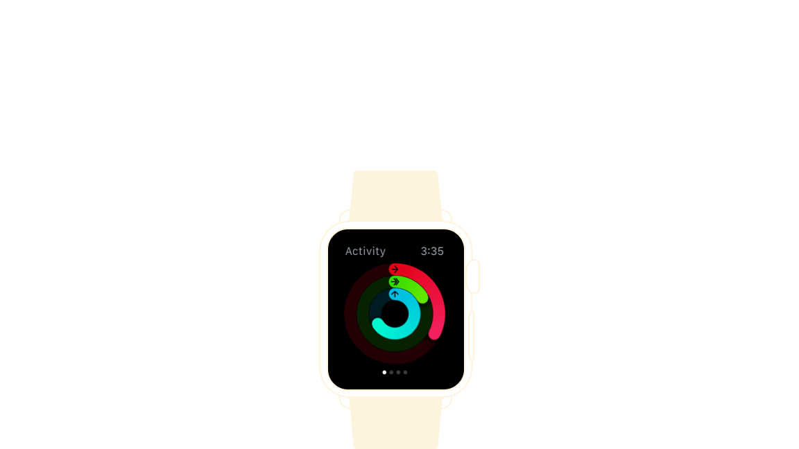

---

# You need to provision your Apple Watch and configure (at least) three targets.

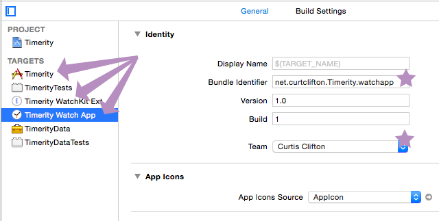

^ Watch UUID in Devices
^ Separate bundle IDs for each target
^ Set the signing identities for each target

---

## WKInterface objects silently ignore commands if their proxied views aren't active.

^ This is especially challenging given that you need to also avoid sending commands more than once.

^ [If OK on time, show code.]

---

### Shared frameworks help encapsulate your data model but require some initial configuration work.

---
### Shared frameworks help encapsulate your data model but require some initial configuration work.

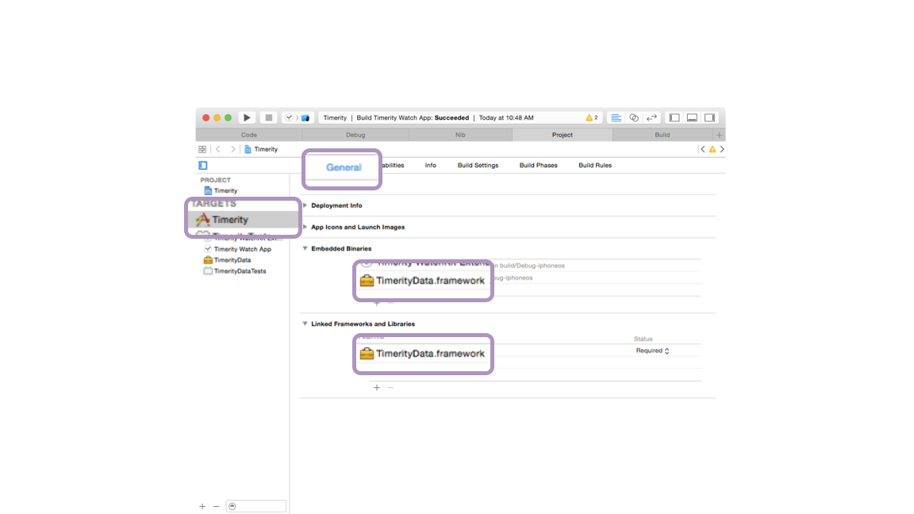

---
### Shared frameworks help encapsulate your data model but require some initial configuration work.

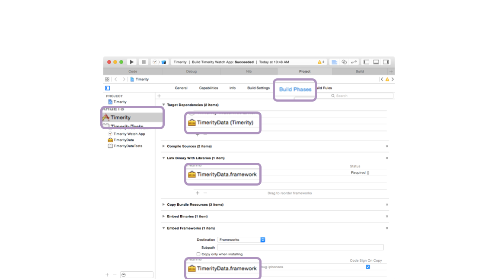

---
### Shared frameworks help encapsulate your data model but require some initial configuration work.

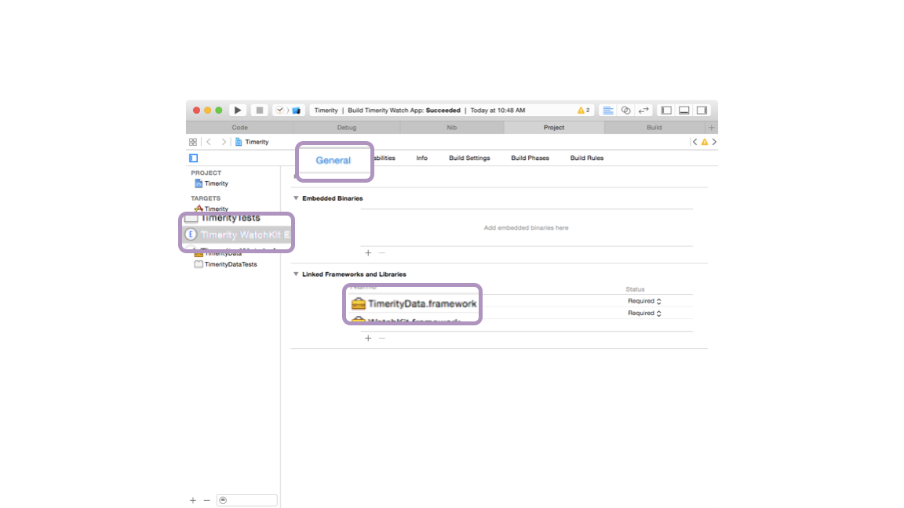

---
### Shared frameworks help encapsulate your data model but require some initial configuration work.

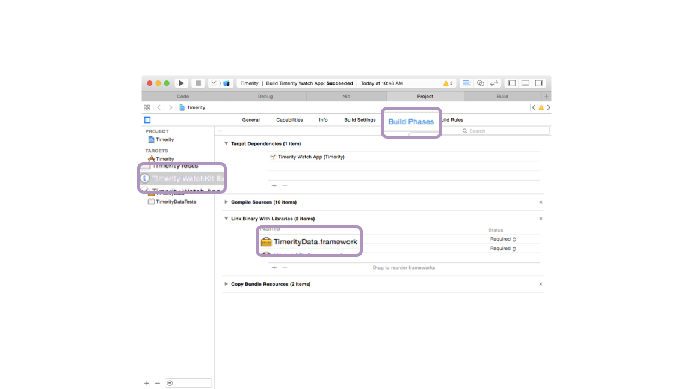

---

# [fit] Useful
# [fit] Resources

^ These are some resources I've found handy.

^ Links will be in the slides posted later

^ [Don't read 'em. If time allows, discuss some highlights, otherwise click through]

---

# From Apple

- [Dev and design resources](http://developer.apple.com/watchkit/)
- [Human Interface Guidelines](https://developer.apple.com/watch/human-interface-guidelines/)
- [Marketing site](http://www.apple.com/watch/)
- [“Secret” watch kit tips](https://devforums.apple.com/thread/264473?tstart=0)

---

# From Others

- [“As I Learn WatchKit”](http://david-smith.org/watchkit/) — David Smith
 - [“Thinking about Load Time”](http://david-smith.org/blog/2015/04/30/ailw-thinking-about-load-time/)
- [“Architecting Your App for WatchKit”](http://realm.io/news/architecting-app-apple-watch-natashatherobot) — Natasha Murashev
- [Apple Watch Code Signing](http://blog.jaredsinclair.com/post/117350678170/jareds-code-signing-tips-apple-watch-edition) — Jared Sinclair
- [WatchKit Development Tips](http://blog.mikeswanson.com/post/117807821714/watchkit-development-tips) — Mike Swanson

---

# Wish List

- Direct access to the Taptic Engine
- API for digital crown
- iPhone-free 3rd party code
- On-device storage

---

# [fit]Thanks!

- @curtclifton
- [curtclifton.net](http://www.curtclifton.net)
- [https://github.com/curtclifton/timerity](https://github.com/curtclifton/timerity)

